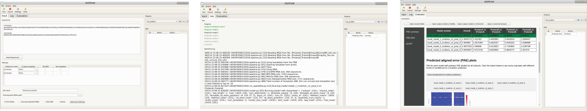

# GUIFold
GUI for running jobs with a local installation of AlphaFold2. Supports submission to queuing systems.

Important note: This is an ALPHA version and development is ongoing. Feedback and bug reports are very welcome.

Main Features:
* Organization of jobs into projects
* Tracking and restoring jobs
* Queue submission with memory estimation and submission script template
* Custom Protein Template
* Disabling MSA and/or template search
* Splitting into feature generation (CPU) and prediction (GPU) steps
* Support of MMseqs2/colabfold MSA pipeline (in addition to original MSA pipeline)
* Evaluation pipeline (PAE/pLDDT tables, PAE plots)




## Recent updates (v0.2)

* Split job setting
* GPU and queue/partition selection moved to submission template
* Addition of variables (total_sequence_length, split_job) that can be used in the submission template logic
* Addition of MMseqs2/colabfold MSA pipeline (Job tab -> "Advanced Settings" -> "DB presets" -> "colabfold")

## Installation

The installation requires conda.

```
mkdir guifold
cd guifold
git clone --recurse-submodules https://github.com/fmi-basel/GUIFold
```

Before proceeding with the installation it is recommended to setup the [global configuration file](#setup-of-global-configuration-file) and [cluster submission script](#setup-of-cluster-submission-template) (if needed).

If you have a separate initialization script for conda (if the initialization is not in your .bashrc) add
```
source path/to/conda_init.sh
```
to the beginning of `guifold/setup_environment.sh`.

Running the setup_environment file will<br/>
* create a conda environment in the same folder<br/>
* install required packages (the packages are listed in the `conda_pkgs.yml` file) <br/>
* install the modified alphafold package<br/>
* install GUIFold<br/><br/>

To start the setup run:
```
bash GUIFold/setup_environment.sh
```
`conda_env` will be the default name of the conda repository. The conda env will be installed with an absolute path (which is also needed for activation).

If you encounter any error try to do the installation step by step.

(Optional) Install [MMseqs2](https://github.com/soedinglab/mmseqs2) to use the colabfold protocol for MSA generation.

### Download of genetic databases and params

Follow instructions in the [AlphaFold readme](https://github.com/deepmind/alphafold#genetic-databases).

If you want to use the colabfold protocol you also need to download "uniref30_2202" and "colabfold_envdb_202108" (available at [Link](https://colabfold.mmseqs.com/)). It is recommended to generate database indices for full performance (see [MMseqs2 documentation](https://mmseqs.com/latest/userguide.pdf)).

### Setup of global configuration file

When GUIFold is installed in a shared location it is recommended 
to create a global configuration file so that the users don't have to configure the paths on their own.
When a user starts the app for the first time and a configuration file exists in the expected location, the parameters will be automatically
transferred to the database of the user (stored in the home directory of the user). The user can change settings in the GUI later on.
Open the file `GUIFold/guifold/config/template.conf` and adapt it to your local environment.
Further explanations of the different parameters are given as comments in the file.
After editing, save the file to `GUIFold/guifold/config/guifold.conf`. It is important to use this specific name and location otherwise it will not be loaded.
When the global configuration needs to be changed later on, the users can re-load it in the Settings dialog of the GUI.

Re-install the package if it has been installed before:
```
(conda activate /path/to/af-conda)
cd GUIFold
python setup.py clean --all install clean --all
```


### Setup of cluster submission template

The Jinja2 package is used to render the submission script template. See [Jinja2 documentation](https://jinja.palletsprojects.com/en/3.0.x/) for further information. The variables listed below can be used to create a template. See also examples below.

The template needs to be saved to `GUIFold/guifold/templates/submit_script.j2`. In the same folder you can find an example for a SLURM cluster.

After saving the template to the above location, re-install the package if it has been installed before:
```
(conda activate /path/to/af-conda)
cd GUIFold
python setup.py clean --all install clean --all
```

#### Automatically splitting a job into CPU and GPU parts
If the queueing system supports dependencies (i.e. a job waits in the queue until another job has finished), the "split job feature" can be activated in the GUI settings if needed. Since the feature generation step does not require GPU, this step can be run on CPU-only resources. Two jobs will be submitted, the first job will request CPU (`use_gpu=False`) and the second job (`use_gpu=True`) will wait for the first job to finish (if the dependency is configured). An example how to add a dependency for SLURM and how to create a conditional to request CPU or GPU resources is provided below. Alternatively, the job can be manually devided into CPU and GPU steps by choosing `Only Features` in the GUI and, after this job has finished, re-starting the job with `Only Features` deactivated. 

#### Variables that can be accessed in the submission template
GUIFold supports the following variables that can be used in the submission template. The parameters are determined based on the input and settings (configuration file or Settings dialog in the app):<br/><br/>
`{{logfile}}` (required) Path to the log file<br/>
`{{account}}` (optional) When a specific account is needed to run jobs on the cluster<br/>
`{{use_gpu}}` (optional) This can be used to build a conditional (example below) to select CPU or GPU nodes/queues<br/>
`{{mem}}` (optional) How much RAM (in GB) should be reserved. The RAM will be automatically increased with the GPU memory for unified memory.<br/>
`{{num_cpus}}` (optional) Number of CPUs to request
`{{total_sequence_length}}` (optional) Total sequence length (not accounting for identical sequences)<br/>
`{{gpu_mem}}` (optional) Useful when the queuing system supports selection of GPU by memory requirement. Value in GB.<br/>
`{{split_mem}}` (optional) If the required memory exceeds the available GPU memory, the job can be run with unified memory. The split_mem variable holds None or the memory split fraction and can be used for a conditional to set the FLAGS required to enable unified memory use (see SLURM example below).<br/>
`{{add_dependency}}` (required) When the job is started with "split job setting", this variable will be True for the second job (prediction step) and allows adding a dependency on the first job (feature step). <br/>
`{{commnad}}` (required) The command to run the AlphaFold job

To cancel jobs from the GUI, the script also needs to write the Job ID to the logfile.
The pattern needs to be as follows:<br/>
```echo "QUEUE_JOB_ID=$JOB_ID_VARIABLE_FROM_QUEUING_SYSTEM"```<br/>
In case of SLURM it would be:<br/>
```echo "QUEUE_JOB_ID=$SLURM_JOB_ID"```

The number of CPUs should be set to 16 (at maximum 1 jackhmmer and 1 hhblits jobs are run in parallel, each set to use 8 CPUs in the respective alphafold.data.tools classes).


#### Example of a template for a SLURM cluster.

The cluster in the example below has two types of GPUs, V100 (32 GB) and A100 (80 GB). The variable gpu_mem can be used
to build conditionals for choosing the appropriate GPU. 


```
#!/bin/bash
#SBATCH --account={{account}}
#SBATCH --job-name=alphafold
#SBATCH --cpus-per-task={{num_cpus}}
#SBATCH --ntasks=1
#SBATCH --nodes=1
#SBATCH --ntasks-per-node=1
#SBATCH --output={{logfile}}
#SBATCH --error={{logfile}}
#Append to logfile
#SBATCH --open-mode=append
#SBATCH --mem={{mem}}G



#SBATCH --gres=gpu:1

#If "Split Job" is selected in the GUI, add_dependency will be True for the second job and create a dependency on the first job (CPU-only)
#SBATCH --dependency=afterok:{{queue_job_id}}
#SBATCH --kill-on-invalid-dep=yes


#Select appropriate GPUs by e.g. constraint, nodename or gpu_name
#SBATCH --constraint=
#SBATCH --partition=

#Select GPUs with > 31 GB memory by e.g. constraint, nodename or gpu_name
#SBATCH --constraint=
#SBATCH --partition=



#If job only needs CPU

#SBATCH --partition=

#SBATCH --partition=





#If job needs to run with unified memory
export TF_FORCE_UNIFIED_MEMORY=True
export XLA_PYTHON_CLIENT_MEM_FRACTION={{split_mem}}


echo "QUEUE_JOB_ID=$SLURM_JOB_ID"

module load ... (or conda activate ...)
{{ command }}
```


### Setup of a modulefile
Instead of activating the conda env you can also create an [environment modulefile](#https://modules.readthedocs.io/) for production use.

Minimal example:
```
#%Module1.0

setenv       ALPHAFOLD_CONDA            /path/to/guifold/af-conda
prepend-path PATH                       $env(ALPHAFOLD_CONDA)/bin
prepend-path LD_LIBRARY_PATH            $env(ALPHAFOLD_CONDA)/lib
prepend-path LD_LIBRARY_PATH            $env(ALPHAFOLD_CONDA)/x86_64-conda-linux-gnu/sysroot/usr/lib64/
prepend-path PYTHONPATH                 $env(ALPHAFOLD_CONDA)/lib/python3.8/site-packages
prepend-path PYTHONPATH                 $env(ALPHAFOLD_CONDA)/lib/python3.8

```


## Usage

When the conda env is activated (conda activate /path/to/af-conda) or added to PATH/LD_LIBRARY_PATH/PYTHONPATH (see [Setup of a module file](#setup-of-a-module-file) you can start GUIFold by typing:<br/>
`afgui.py`

To re-run an evaluation go to the job folder (where the FASTA sequence is stored) and type<br/>
`afeval.py --fasta_path name_of_sequence.fasta`


## Licenses

GUIFold is licensed under the Apache License, Version 2.0.

Icons are from the GTK framework, licensed under [GPL](https://gitlab.gnome.org/GNOME/gtk/-/blob/main/COPYING).

The modified AlphaFold code retains its original license. See (https://github.com/deepmind/alphafold)

Third-party software and libraries may be governed by separate terms and conditions or license provisions. Your use of the third-party software, libraries or code is subject to any such terms and you should check that you can comply with any applicable restrictions or terms and conditions before use.